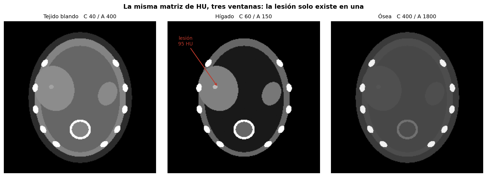
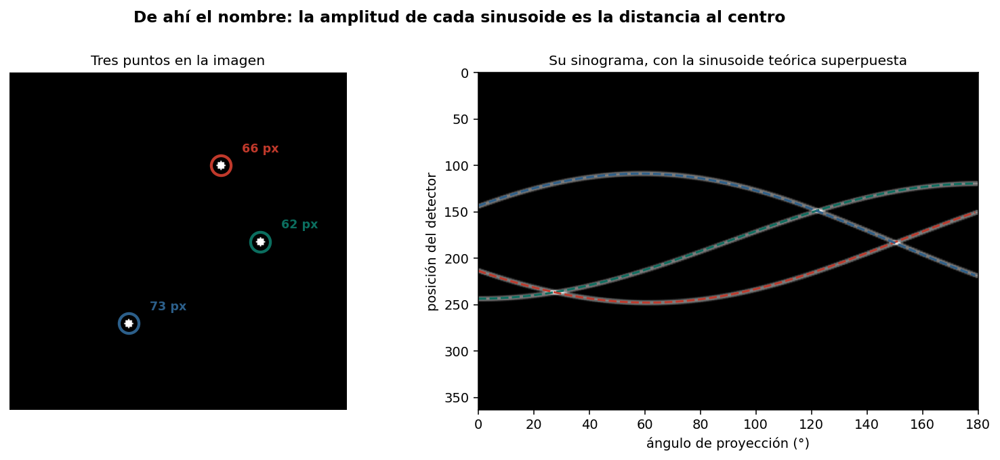
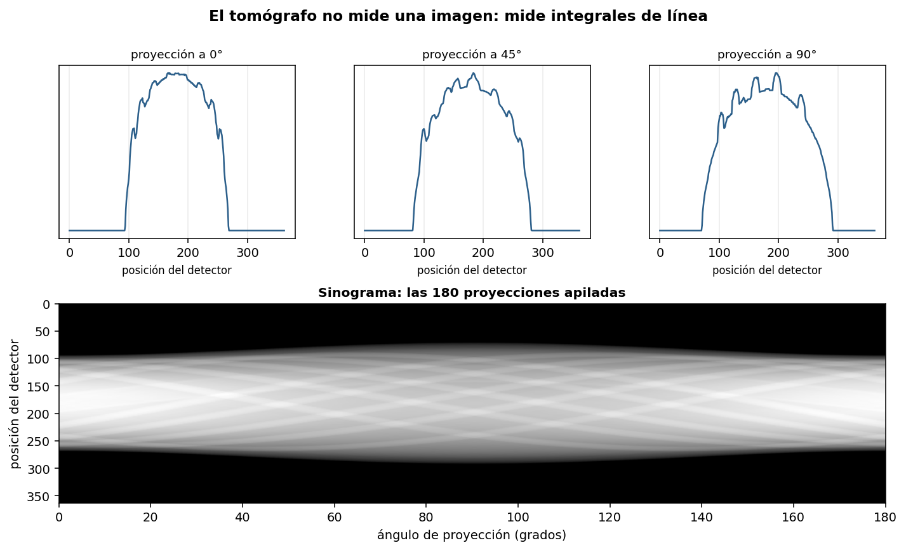

# Cómo ve un tomógrafo

Construcción de un corte abdominal con valores de atenuación reales, generación de sus
proyecciones mediante la transformada de Radon, e interpretación cuantitativa del
sinograma.



## El dato que enmarca todo

Por el eje mayor de un abdomen sobrevive el **1.2% de los fotones** que entraron:

```
rayo central a 0°:  ∫μ ds = 4.46
I/I₀ = e^(-4.46) = 0.0115
```

Esa es la raíz física del compromiso entre calidad de imagen y dosis. No es un problema de
ingeniería que pueda optimizarse hasta desaparecer.

## Lo que mide el detector

Por Beer-Lambert, el detector mide una **integral de línea**:

```
−ln(I/I₀) = ∫ μ(s) ds
```

El tomógrafo no mide densidades punto por punto. Reconstruir es despejar μ a partir de
decenas de miles de esas sumas.

## Unidades Hounsfield

| Tejido | HU |
|---|---|
| Aire | −1000 |
| Pulmón | −700 |
| Grasa | −90 |
| Agua | 0 |
| Músculo | 45 |
| Hígado | 60 |
| Hueso esponjoso | 300 |
| Hueso cortical | 1200 |

`src/fantoma.py` construye el corte directamente en HU y lo convierte a coeficiente de
atenuación. La lesión hepática de 95 HU es invisible en ventana de tejido blando y evidente
en ventana de hígado: los datos son los mismos, cambia el mapeo a grises.

## Verificación: por qué se llama sinograma

Un punto a distancia r del centro se proyecta según s(θ) = r·cos(θ − φ), una sinusoide de
amplitud r. Ajustando por mínimos cuadrados sobre el sinograma real:

| Punto | Distancia real | Amplitud ajustada | Error |
|---|---|---|---|
| (128,128) | 0.0 px | 0.1 px | 0.1 |
| (128,190) | 62.0 px | 61.9 px | 0.1 |
| (70,160) | 66.2 px | 66.3 px | 0.1 |
| (190,90) | 72.7 px | 72.8 px | 0.0 |



La fórmula de proyección en la convención de `skimage.transform.radon` es
`s(θ) = dx·cos θ − dy·sin θ`, deducida empíricamente y verificada contra el sinograma.

## Leer un sinograma en la práctica



- Línea horizontal brillante en todos los ángulos → detector averiado
- Discontinuidad vertical → el paciente se movió
- Sinusoide de amplitud mayor que el campo de visión → algo fuera del campo contamina

Cada punto de la imagen se reparte por **todo** el sinograma, de modo que cada dato perdido
afecta a la reconstrucción completa. De ahí que un implante metálico lance artefactos por
toda la imagen y no solo en su vecindad.

## Contenido

```
notebooks/ct_radon_sinograma.ipynb   Notebook completo, ejecutable sin datos externos
src/fantoma.py                       Corte abdominal en unidades Hounsfield
figuras/                             Figuras generadas
```

## Reproducir

```bash
git clone https://github.com/USUARIO/ct-radon-sinograma.git
cd ct-radon-sinograma
pip install -r requirements.txt
jupyter lab notebooks/ct_radon_sinograma.ipynb
```

## Limitaciones

**Modelo monocromático.** Un tubo real emite un espectro; los fotones de menor energía se
absorben antes, produciendo endurecimiento del haz (bandas oscuras entre estructuras
densas). No modelado aquí.

**Sin ruido de fotones.** La detección de rayos X es un proceso de Poisson y con dosis baja
el ruido domina.

**Geometría de haz paralelo.** Los equipos modernos usan abanico o cono (algoritmo de
Feldkamp). El paralelo es la base didáctica correcta.

**El fantoma es una idealización**: tejidos homogéneos y bordes elípticos.

## Referencias

- Radon J. *Über die Bestimmung von Funktionen durch ihre Integralwerte längs gewisser Mannigfaltigkeiten.* Berichte Sächsische Akademie der Wissenschaften, 1917.
- Hounsfield G.N. *Computerized transverse axial scanning (tomography).* British Journal of Radiology, 1973.
- Kak A.C., Slaney M. *Principles of Computerized Tomographic Imaging.* IEEE Press, 1988.

## Licencia

MIT — ver [LICENSE](LICENSE).
